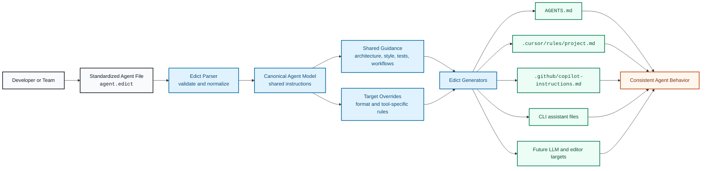

# Edict

Edict is a CLI for generating agent configuration files for different LLM tools,
editors, and coding assistants from one standardized agent file.

## The Problem

AI coding tools are converging on the same basic need: they need project-specific
instructions, conventions, workflows, and tool usage rules. But every product
expects those instructions in a different place and format.

Common examples include:

- repository-level agent instructions
- editor-specific assistant rules
- model-specific system or developer guidance
- CLI assistant configuration files
- prompt fragments copied across multiple tools

This creates a maintenance problem. Teams end up duplicating the same guidance
across several files, such as instructions for architecture, testing, coding
style, commit rules, review expectations, and local commands.

The result is drift:

- one assistant has the latest instructions while another uses stale guidance
- fixes must be copied manually into many files
- each editor or LLM integration becomes a separate source of truth
- onboarding a new tool requires rewriting the same project context again
- teams cannot easily verify which agent instructions are canonical

As more assistants and editors appear, this gets worse. The project knowledge
that should be stable becomes scattered across tool-specific configuration.

## The Solution

Edict uses a single standardized agent file as the source of truth.

Instead of maintaining separate instruction files for every assistant, you define
the project's agent contract once. Edict then generates the target files required
by each supported LLM tool, editor, or coding assistant.

The standardized file captures shared project guidance, such as:

- project purpose and architecture
- coding conventions
- test and build commands
- review expectations
- security and safety rules
- repository-specific workflows
- tool-specific overrides when needed

From that source, the CLI can emit files tailored for different targets while
preserving one canonical instruction set.

## How It Works

The intended workflow is:

1. Write one standardized agent file for the repository.
2. Choose one or more output targets, such as an editor or LLM assistant.
3. Run the Edict CLI.
4. Commit the generated files or use them locally, depending on the team's
   workflow.

Conceptually:

```text
agent.edict
   -> AGENTS.md
   -> .cursor/rules/project.md
   -> .github/copilot-instructions.md
   -> tool-specific assistant files
```

The exact target list can grow over time without changing the core authoring
model. Adding support for a new assistant should mean adding a new generator,
not rewriting project guidance.

## Solution Schema



## Why This Matters

Edict makes agent instructions easier to maintain, review, and trust.

With one source of truth:

- changes to agent behavior are reviewed in one place
- generated files stay consistent across tools
- teams can adopt new assistants without starting from scratch
- tool-specific formats become build artifacts instead of hand-maintained docs
- project guidance becomes portable across editors and LLM providers

The goal is not to force every assistant into the exact same behavior. Some
tools need different formatting, capabilities, or constraints. The goal is to
make shared guidance canonical, then let generators adapt that guidance to each
target's expectations.

## Project Direction

Edict is designed around a small set of ideas:

- a readable standardized agent format
- deterministic generation
- explicit target adapters
- minimal hidden behavior
- clean separation between shared guidance and tool-specific output

This keeps the CLI predictable while still allowing the supported ecosystem of
LLMs, editors, and agent tools to expand.
